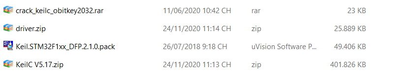
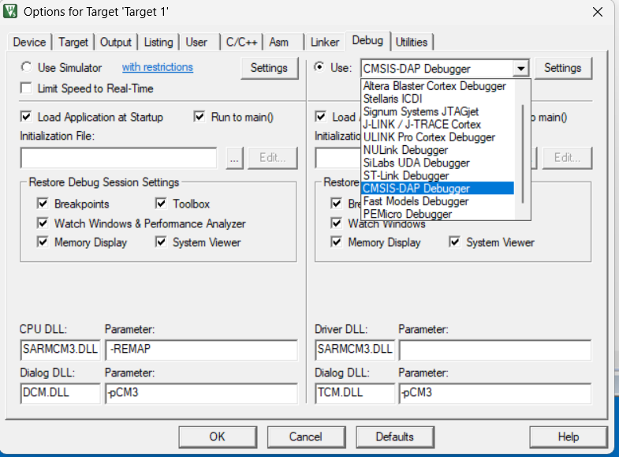
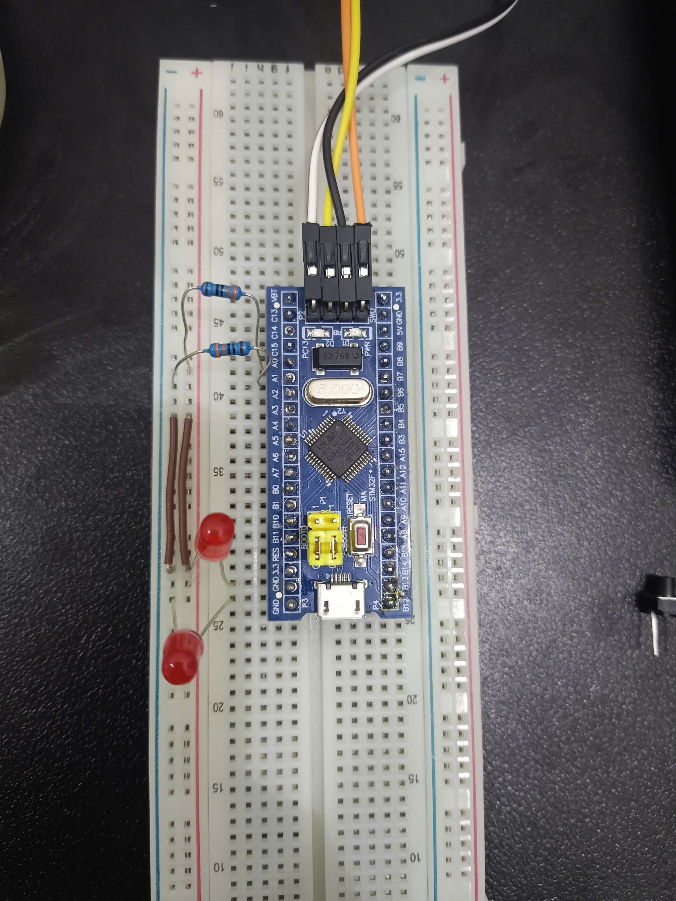
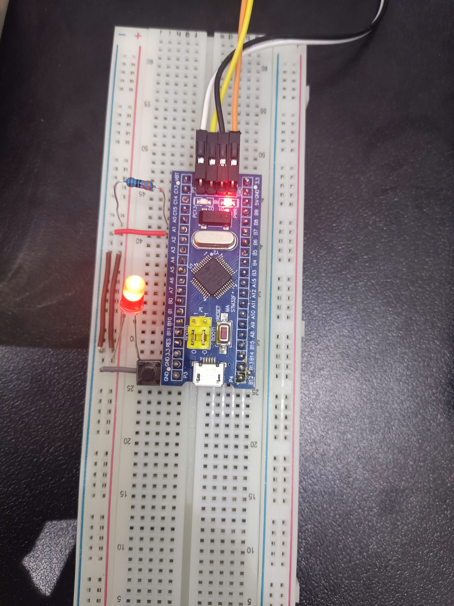

# NHÓM 3 - HỆ THỐNG NHÚNG - BÁO CÁO BÀI TẬP TUẦN 1 

## 1. Cài đặt phần mềm, công cụ lập trình cho STM32F1

> Tải folder từ link: https://ptiteduvn-my.sharepoint.com/my?id=%2Fpersonal%2Fcanhnd%5Fb22dt043%5Fstu%5Fptit%5Fedu%5Fvn%2FDocuments%2FAPP%2FVXL&login_hint=CanhND%2EB22DT043%40stu%2Eptit%2Eedu%2Evn

**Chú ý: Khi tải và cài đặt KeilC phải tắt trình quét Viruss trên máy nếu không sẽ khi tải về file crack sẽ tự động xóa**

- Thực hiện giải nén folder thu được tệp như sau:



trong đó bao gồm 1 file packet của toàn bộ Series STM32F1xx từ đó chỉ cần chạy file là trong máy sẽ tự có và không cần phải cài đặt các gói khác trong KeilC. Bên cạnh đó, trong tệp `Crack.zip` giải nén có folder `keygen` chạy song song 2 chương trình để sao chép mã `UID` paste vào `keygen` và chọn loại chip `ARM`. Cuối cùng bấm `Generate` sẽ có liences cho KeilC (sử dụng đến 2032)

- Đối với các mạch nạp cần Driver tuy nhiên ở đây em sử dụng mạch nạp DAP Link nên không cần sử dụng Driver cho mạch nạp. Đối với mạch nạp phổ thông hơn là `ST-Link` thì cần cài driver.



> Chương trình nạp thử:

```c
#include "stm32f10x.h"                  // Device header

int main (void){
	while (1){
		
	}
}
```

-> Bấm phím `F7` để build toàn bộ chương trình thu được kết quả như sau:

```
*** Using Compiler 'V5.06 update 1 (build 61)', folder: 'C:\Keil_v5\ARM\ARMCC\Bin'
Build target 'Target 1'
assembling startup_stm32f10x_md.s...
compiling main.c...
compiling misc.c...
compiling system_stm32f10x.c...
compiling stm32f10x_gpio.c...
compiling stm32f10x_rcc.c...
linking...
Program Size: Code=648 RO-data=252 RW-data=0 ZI-data=1632  
".\Objects\KeilC.axf" - 0 Error(s), 0 Warning(s).
Build Time Elapsed:  00:00:01
```

-> Bấm phím `F8` để nạp chương trình vào kit kết quả hiển thị

```
Load "C:\\Users\\ASUS\\Documents\\STM\\PRJ\\HTN_B1\\MDK\\Objects\\KeilC.axf" 
Erase Done.
Programming Done.
Verify OK.
Flash Load finished at 15:45:57
```

#### Video: https://drive.google.com/file/d/1vdSkb9WA2iEoH6vJ8XkFmnQU-Owkfd7V/view?usp=drive_link

## 2. Cấu hình GPIO và nạp chương trình

### 2.1. Cấu hình 2 nhóm LED ở chế độ Output, LED nhấp nháy với chu kỳ 1000ms 

> Ý tưởng:

- Thực hiện cấu hình GPIO chọn port quan tâm về port, mode và speed

- Viết hàm delay tương đối sau có thể thay thế bằng `Systick` hoặc `Timer` cho các bài sau

- Sử dụng SetBits và ResetBits để đảo trạng thái LED

> Phần cứng:



#### Souce code: [Tiến trình 1](src/bt1.c)

#### Video Demo: [DEMO](https://drive.google.com/file/d/1XVGsyST2Zve9NzupkfItLdir1fCz9NbD/view?usp=drive_link)

### 2.2. Cấu hình 1 LED ở trạng thái Output và 1 nút bấm ở trạng thái Input, LED thay đổi trạng thái khi người dùng bấm nút

> Ý tưởng

- Cấu hình GPIO

    - LED: cấu hình chân Output (Push-pull, tốc độ phù hợp).

    - Nút bấm: cấu hình chân Input.

    - Có thể chọn Input Pull-up hoặc Pull-down tùy cách nối nút, ví dụ: nếu nút nối về GND khi nhấn → dùng Pull-up.

- Nguyên tắc hoạt động

> Ban đầu LED tắt (GPIO = 0). Khi người dùng nhấn nút, chương trình kiểm tra trạng thái chân Input. Nếu phát hiện cạnh nhấn (nhấn xuống), đảo trạng thái LED (từ ON → OFF hoặc OFF → ON).Khi thả nút thì không thay đổi, chỉ khi có nhấn mới đổi.

> Phần cứng



#### Source code: [Tiến trình 2](src/bt2.c)

#### Video Demo: [VIDEO DEMO](https://drive.google.com/file/d/1V6w4_qXco7EdRfBLSQF3AY87UfdFHwEQ/view?usp=drive_link)