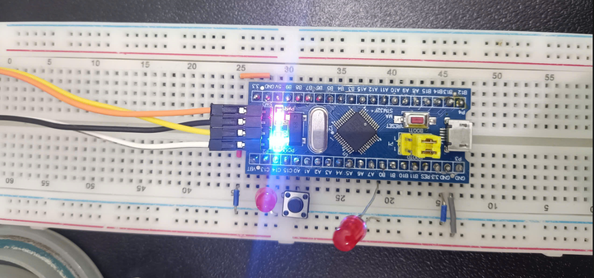
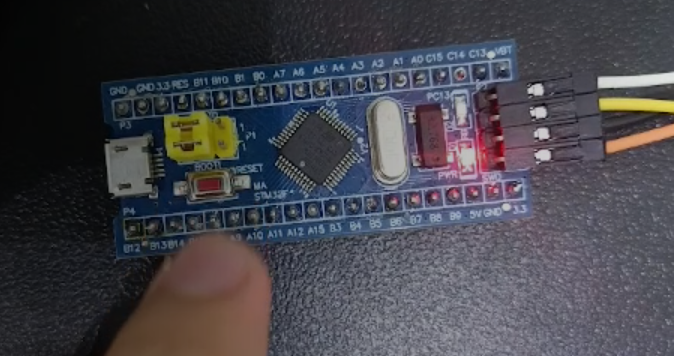

# NHÓM 3 - HỆ THỐNG NHÚNG - BÁO CÁO BÀI TẬP TUẦN 2

## A. Nội dung công việc

### 1. Hiếu được cơ chế ngắt ngoài

> - Cấu hình ngắt ngoài cho 1 nút nhấn. Khi nhấn nút, trạng thái của LED sẽ đảo ngược
> - Trong thời gian đó một LED khác nhấp nháy với chu kỳ 1Hz

### 2. Sử dụng Timer để tạo ra các sự kiện định kỳ

> - Cấu hình Timer ở chế độ cơ bản, sử dụng Timer để tạo hàm Delay đạt độ chính xác cao
> - Cấu hình một Timer cơ bản để ngắt ngoài mỗi 500ms. Trong ISR của timer, đảo trạng thái LED LD2. Kết quả LED nhấp nháy với chu kỳ 1000ms

## B. Nội dung chi tiết

### 1. Hiểu được cơ chế ngắt ngoài

> - Cấu hình ngắt ngoài cho 1 nút nhấn. Khi nhấn nút, trạng thái của LED sẽ đảo ngược
> - Trong thời gian đó một LED khác nhấp nháy với chu kỳ 1Hz

**Ý tưởng**

- Chọn 1 chân GPIO làm input để đọc nút nhấn.

- Bật pull-up hoặc pull-down để tránh trôi mức logic khi nút không nhấn.

- Cấu hình ngắt ngoài (EXTI) cho cạnh xuống hoặc lên (tùy cách mắc nút).

- Trong ISR (Interrupt Service Routine) của EXTI, bạn chỉ cần đảo trạng thái một biến led_state. Biến này sẽ quyết định LED1 sáng hay tắt.

**Cấu hình**

|            | GPIO | Port |       MODE       |
|:----------:|:----:|:----:|:----------------:|
|  LED (LD1) |  14  |   C  | Output Push Pull |
|  LED (LD2) |  0   |   B  | Output Push Pull |
|  Nút bấm   |  0   |   A  | Input Pull Up    |

**Phần cứng**

**Phần mềm** [Interrupt.c](src/Interrupt.c)

**Video Demo** 

https://drive.google.com/file/d/1CIMIW-pXwsDMKLbDViYz4cq3aeOrNV52/view?usp=sharing

### 2. Sử dụng Timer để tạo ra các sự kiện định kỳ

> - Cấu hình Timer ở chế độ cơ bản, sử dụng Timer để tạo hàm Delay đạt độ chính xác cao
> - Cấu hình một Timer cơ bản để ngắt ngoài mỗi 500ms. Trong ISR của timer, đảo trạng thái LED LD2. Kết quả LED nhấp nháy với chu kỳ 1000ms

**Ý tưởng**

> Cấu hình Timer cơ bản (ở đây chúng em sử dụng TIM2):

- Sử dụng xung clock hệ thống (APB1).

- Chọn Prescaler (PSC) và Auto-reload Register (ARR) sao cho Timer tràn đúng chu kỳ mong muốn.

- Với HCLK = 72 MHz, APB1 Timer clock = 72 MHz:

- Nếu chọn PSC = 7200 - 1 = 7199 → tần số timer = 10 kHz (chu kỳ 0.1 ms).

- Đặt ARR = 5000 - 1 = 4999 → Timer tràn mỗi 500 ms.

> Cấu hình ngắt Timer và xử lý ngắt NVIC

- Cho phép ngắt trong NVIC.

- Trong ISR: đảo trạng thái LED LD2 (chân PC13).

- Viết hàm Delay dùng Timer:

- Reset counter về 0.

- Chờ cho đến khi counter đạt giá trị mong muốn.

|Cấu hình | Port/Loại | Pin |
|----|---|---|
|LED | GPIOC | 13   |
|TIM | 2     | APB1 |
---

**Phần cứng**

**Phần mềm** [Timer.c](src/Timer.c)

**Video Demo**

https://drive.google.com/file/d/1y57MHn31gfrJJNz1nsthUtereApnllgw/view?usp=sharing